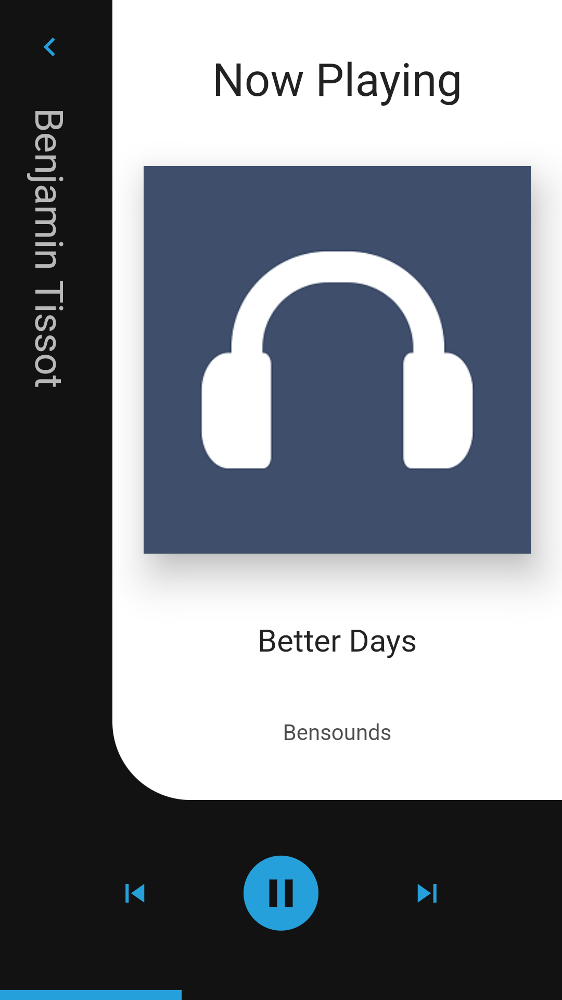
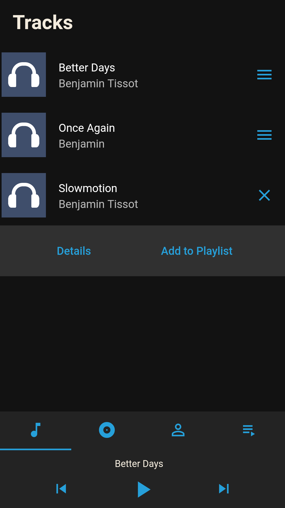
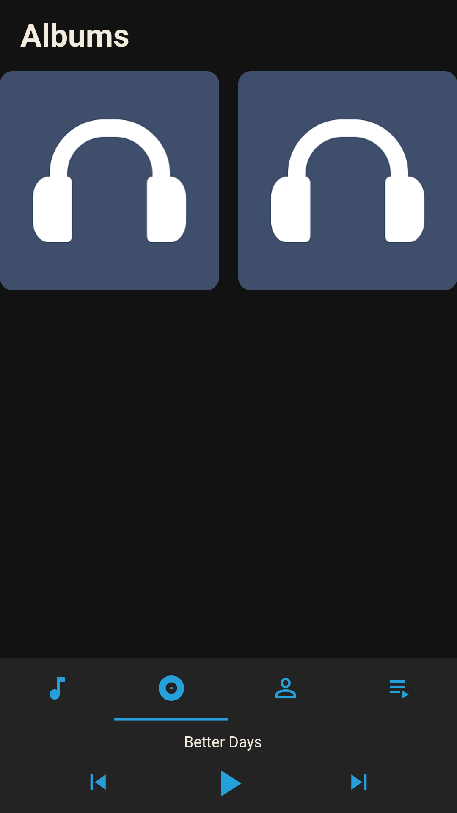
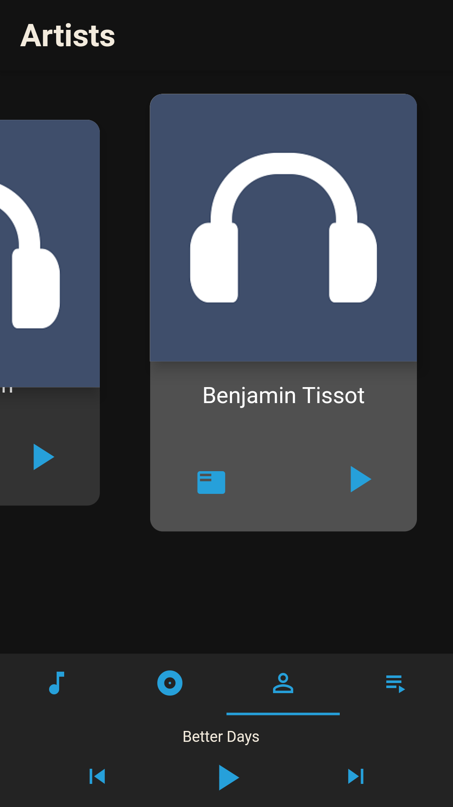
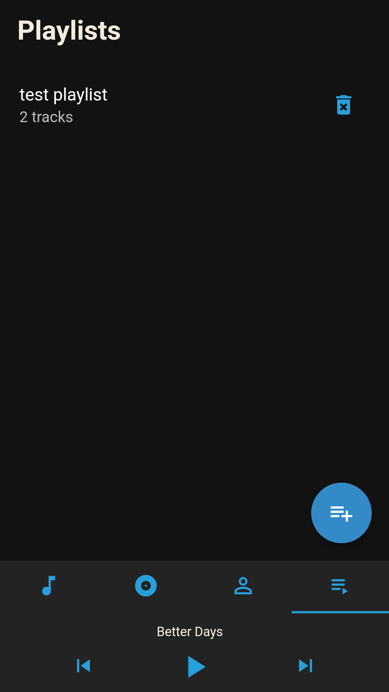

# mount_music_player

Built With Flutter SDK
#### Dark Material Design

## Packages used:

flutter_audio_query

provider

audioplayers
  
## Functionalities:

Audio Skipping

Audio Seeking

Display of audio details

playlist creation and deletion
  
## Custom Widgets Built:

A custom expansion tile since the default one provided can only detect
taps to expand and no other operation can be performed as an onTap
callback. The custom one comes with an icon which can be pressed
to expand and taps can be used for other purposes
  
A music player screen which animates into view when the bottom control
area is tapped or dragged upwards
  
A beautiful carousel with pop up effect scrolling

Screenshots:

